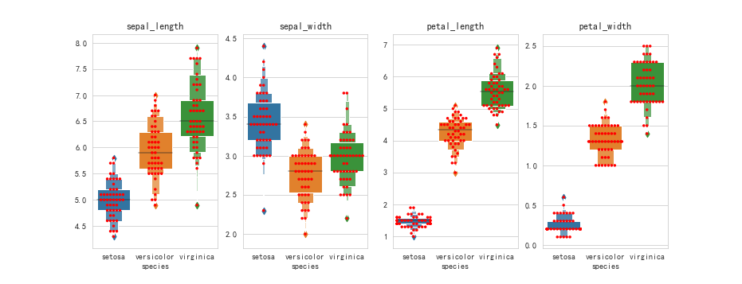
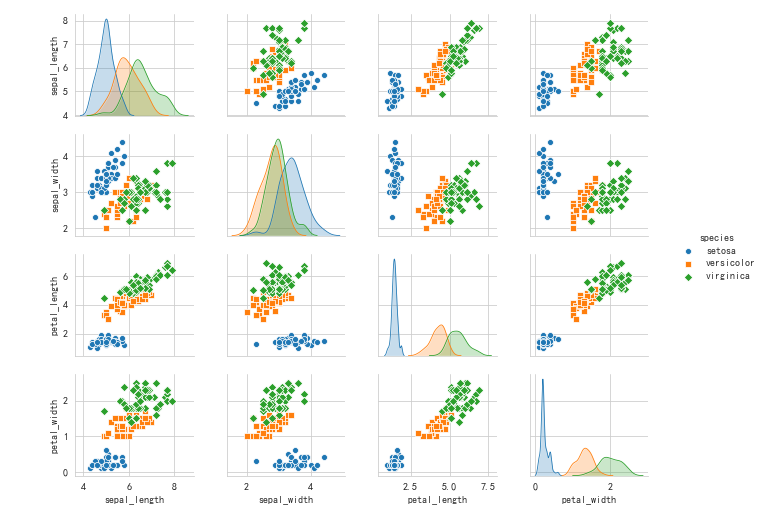
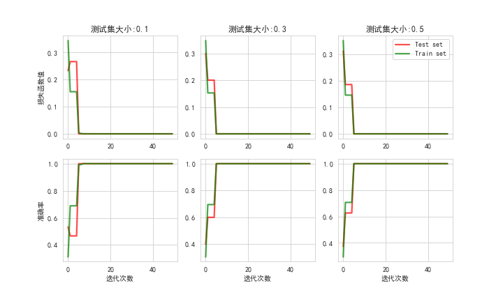
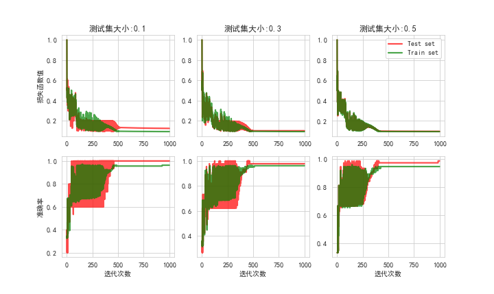
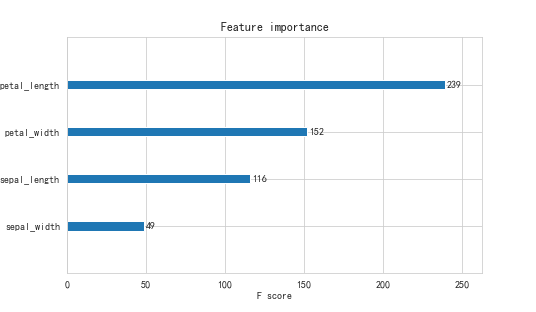
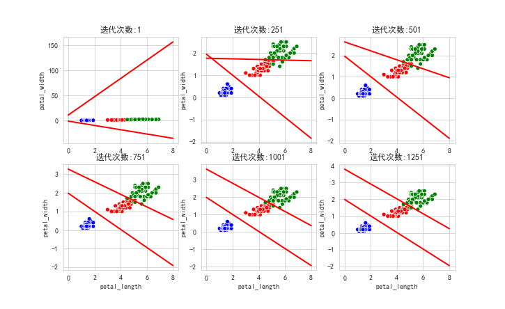

# 对数几率模型在Iris数据集上的实现
---
本代码属于机器学习的基础内容, 适合初学者使用.

本代码包含了：

- 数据的简单可视化

 箱线图(观察数据分布特点):

  
  
箱线图

 多变量图(发现属性间的相关性):

  

- 二分类情况

 将species属性进行编码, 属于Setosa类型的样本标记为1, 否则标记为0, 则问题转化为一个二分类问题.
 
 损失函数以及准确率变化：

  

- 多分类情况

 将数据集中的species属性重新进行编码, 采用one-hot编码方式, 并使模型输出三个预测值. 然后取最大值作为预测结果. 则问题转化为一个多分类问题.
 
 损失函数以及准确率变化曲线：

  

- 获取属性的重要程度

 各属性重要程度(筛选掉不重要因素, 利于模型可视化)：

  

- 模型动态可视化

 从可视化的角度阐述模型
 

  

  

