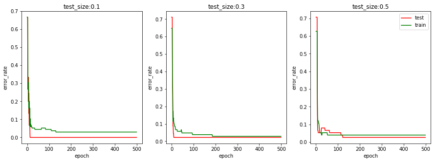

```python
import numpy as np
import pandas as pd
import seaborn as sns
import matplotlib.pyplot as plt
from sklearn.model_selection import train_test_split
from sklearn import metrics

#加载数据集
iris=sns.load_dataset("iris")
iris
# & Sepal.Length（花萼长度），单位是cm;
# & Sepal.Width（花萼宽度），单位是cm;
# & Petal.Length（花瓣长度），单位是cm;
# & Petal.Width（花瓣宽度），单位是cm;
# Iris Setosa（山鸢尾）、Iris Versicolour（杂色鸢尾），以及Iris Virginica（维吉尼亚鸢尾）。
```


<div>
<style scoped>
    .dataframe tbody tr th:only-of-type {
        vertical-align: middle;
    }

    .dataframe tbody tr th {
        vertical-align: top;
    }

    .dataframe thead th {
        text-align: right;
    }
</style>
<table border="1" class="dataframe">
  <thead>
    <tr style="text-align: right;">
      <th></th>
      <th>sepal_length</th>
      <th>sepal_width</th>
      <th>petal_length</th>
      <th>petal_width</th>
      <th>species</th>
    </tr>
  </thead>
  <tbody>
    <tr>
      <th>0</th>
      <td>5.1</td>
      <td>3.5</td>
      <td>1.4</td>
      <td>0.2</td>
      <td>setosa</td>
    </tr>
    <tr>
      <th>1</th>
      <td>4.9</td>
      <td>3.0</td>
      <td>1.4</td>
      <td>0.2</td>
      <td>setosa</td>
    </tr>
    <tr>
      <th>2</th>
      <td>4.7</td>
      <td>3.2</td>
      <td>1.3</td>
      <td>0.2</td>
      <td>setosa</td>
    </tr>
    <tr>
      <th>3</th>
      <td>4.6</td>
      <td>3.1</td>
      <td>1.5</td>
      <td>0.2</td>
      <td>setosa</td>
    </tr>
    <tr>
      <th>4</th>
      <td>5.0</td>
      <td>3.6</td>
      <td>1.4</td>
      <td>0.2</td>
      <td>setosa</td>
    </tr>
    <tr>
      <th>5</th>
      <td>5.4</td>
      <td>3.9</td>
      <td>1.7</td>
      <td>0.4</td>
      <td>setosa</td>
    </tr>
    <tr>
      <th>6</th>
      <td>4.6</td>
      <td>3.4</td>
      <td>1.4</td>
      <td>0.3</td>
      <td>setosa</td>
    </tr>
    <tr>
      <th>7</th>
      <td>5.0</td>
      <td>3.4</td>
      <td>1.5</td>
      <td>0.2</td>
      <td>setosa</td>
    </tr>
    <tr>
      <th>8</th>
      <td>4.4</td>
      <td>2.9</td>
      <td>1.4</td>
      <td>0.2</td>
      <td>setosa</td>
    </tr>
    <tr>
      <th>9</th>
      <td>4.9</td>
      <td>3.1</td>
      <td>1.5</td>
      <td>0.1</td>
      <td>setosa</td>
    </tr>
    <tr>
      <th>10</th>
      <td>5.4</td>
      <td>3.7</td>
      <td>1.5</td>
      <td>0.2</td>
      <td>setosa</td>
    </tr>
    <tr>
      <th>11</th>
      <td>4.8</td>
      <td>3.4</td>
      <td>1.6</td>
      <td>0.2</td>
      <td>setosa</td>
    </tr>
    <tr>
      <th>12</th>
      <td>4.8</td>
      <td>3.0</td>
      <td>1.4</td>
      <td>0.1</td>
      <td>setosa</td>
    </tr>
    <tr>
      <th>13</th>
      <td>4.3</td>
      <td>3.0</td>
      <td>1.1</td>
      <td>0.1</td>
      <td>setosa</td>
    </tr>
    <tr>
      <th>14</th>
      <td>5.8</td>
      <td>4.0</td>
      <td>1.2</td>
      <td>0.2</td>
      <td>setosa</td>
    </tr>
    <tr>
      <th>15</th>
      <td>5.7</td>
      <td>4.4</td>
      <td>1.5</td>
      <td>0.4</td>
      <td>setosa</td>
    </tr>
    <tr>
      <th>16</th>
      <td>5.4</td>
      <td>3.9</td>
      <td>1.3</td>
      <td>0.4</td>
      <td>setosa</td>
    </tr>
    <tr>
      <th>17</th>
      <td>5.1</td>
      <td>3.5</td>
      <td>1.4</td>
      <td>0.3</td>
      <td>setosa</td>
    </tr>
    <tr>
      <th>18</th>
      <td>5.7</td>
      <td>3.8</td>
      <td>1.7</td>
      <td>0.3</td>
      <td>setosa</td>
    </tr>
    <tr>
      <th>19</th>
      <td>5.1</td>
      <td>3.8</td>
      <td>1.5</td>
      <td>0.3</td>
      <td>setosa</td>
    </tr>
    <tr>
      <th>20</th>
      <td>5.4</td>
      <td>3.4</td>
      <td>1.7</td>
      <td>0.2</td>
      <td>setosa</td>
    </tr>
    <tr>
      <th>21</th>
      <td>5.1</td>
      <td>3.7</td>
      <td>1.5</td>
      <td>0.4</td>
      <td>setosa</td>
    </tr>
    <tr>
      <th>22</th>
      <td>4.6</td>
      <td>3.6</td>
      <td>1.0</td>
      <td>0.2</td>
      <td>setosa</td>
    </tr>
    <tr>
      <th>23</th>
      <td>5.1</td>
      <td>3.3</td>
      <td>1.7</td>
      <td>0.5</td>
      <td>setosa</td>
    </tr>
    <tr>
      <th>24</th>
      <td>4.8</td>
      <td>3.4</td>
      <td>1.9</td>
      <td>0.2</td>
      <td>setosa</td>
    </tr>
    <tr>
      <th>25</th>
      <td>5.0</td>
      <td>3.0</td>
      <td>1.6</td>
      <td>0.2</td>
      <td>setosa</td>
    </tr>
    <tr>
      <th>26</th>
      <td>5.0</td>
      <td>3.4</td>
      <td>1.6</td>
      <td>0.4</td>
      <td>setosa</td>
    </tr>
    <tr>
      <th>27</th>
      <td>5.2</td>
      <td>3.5</td>
      <td>1.5</td>
      <td>0.2</td>
      <td>setosa</td>
    </tr>
    <tr>
      <th>28</th>
      <td>5.2</td>
      <td>3.4</td>
      <td>1.4</td>
      <td>0.2</td>
      <td>setosa</td>
    </tr>
    <tr>
      <th>29</th>
      <td>4.7</td>
      <td>3.2</td>
      <td>1.6</td>
      <td>0.2</td>
      <td>setosa</td>
    </tr>
    <tr>
      <th>...</th>
      <td>...</td>
      <td>...</td>
      <td>...</td>
      <td>...</td>
      <td>...</td>
    </tr>
    <tr>
      <th>120</th>
      <td>6.9</td>
      <td>3.2</td>
      <td>5.7</td>
      <td>2.3</td>
      <td>virginica</td>
    </tr>
    <tr>
      <th>121</th>
      <td>5.6</td>
      <td>2.8</td>
      <td>4.9</td>
      <td>2.0</td>
      <td>virginica</td>
    </tr>
    <tr>
      <th>122</th>
      <td>7.7</td>
      <td>2.8</td>
      <td>6.7</td>
      <td>2.0</td>
      <td>virginica</td>
    </tr>
    <tr>
      <th>123</th>
      <td>6.3</td>
      <td>2.7</td>
      <td>4.9</td>
      <td>1.8</td>
      <td>virginica</td>
    </tr>
    <tr>
      <th>124</th>
      <td>6.7</td>
      <td>3.3</td>
      <td>5.7</td>
      <td>2.1</td>
      <td>virginica</td>
    </tr>
    <tr>
      <th>125</th>
      <td>7.2</td>
      <td>3.2</td>
      <td>6.0</td>
      <td>1.8</td>
      <td>virginica</td>
    </tr>
    <tr>
      <th>126</th>
      <td>6.2</td>
      <td>2.8</td>
      <td>4.8</td>
      <td>1.8</td>
      <td>virginica</td>
    </tr>
    <tr>
      <th>127</th>
      <td>6.1</td>
      <td>3.0</td>
      <td>4.9</td>
      <td>1.8</td>
      <td>virginica</td>
    </tr>
    <tr>
      <th>128</th>
      <td>6.4</td>
      <td>2.8</td>
      <td>5.6</td>
      <td>2.1</td>
      <td>virginica</td>
    </tr>
    <tr>
      <th>129</th>
      <td>7.2</td>
      <td>3.0</td>
      <td>5.8</td>
      <td>1.6</td>
      <td>virginica</td>
    </tr>
    <tr>
      <th>130</th>
      <td>7.4</td>
      <td>2.8</td>
      <td>6.1</td>
      <td>1.9</td>
      <td>virginica</td>
    </tr>
    <tr>
      <th>131</th>
      <td>7.9</td>
      <td>3.8</td>
      <td>6.4</td>
      <td>2.0</td>
      <td>virginica</td>
    </tr>
    <tr>
      <th>132</th>
      <td>6.4</td>
      <td>2.8</td>
      <td>5.6</td>
      <td>2.2</td>
      <td>virginica</td>
    </tr>
    <tr>
      <th>133</th>
      <td>6.3</td>
      <td>2.8</td>
      <td>5.1</td>
      <td>1.5</td>
      <td>virginica</td>
    </tr>
    <tr>
      <th>134</th>
      <td>6.1</td>
      <td>2.6</td>
      <td>5.6</td>
      <td>1.4</td>
      <td>virginica</td>
    </tr>
    <tr>
      <th>135</th>
      <td>7.7</td>
      <td>3.0</td>
      <td>6.1</td>
      <td>2.3</td>
      <td>virginica</td>
    </tr>
    <tr>
      <th>136</th>
      <td>6.3</td>
      <td>3.4</td>
      <td>5.6</td>
      <td>2.4</td>
      <td>virginica</td>
    </tr>
    <tr>
      <th>137</th>
      <td>6.4</td>
      <td>3.1</td>
      <td>5.5</td>
      <td>1.8</td>
      <td>virginica</td>
    </tr>
    <tr>
      <th>138</th>
      <td>6.0</td>
      <td>3.0</td>
      <td>4.8</td>
      <td>1.8</td>
      <td>virginica</td>
    </tr>
    <tr>
      <th>139</th>
      <td>6.9</td>
      <td>3.1</td>
      <td>5.4</td>
      <td>2.1</td>
      <td>virginica</td>
    </tr>
    <tr>
      <th>140</th>
      <td>6.7</td>
      <td>3.1</td>
      <td>5.6</td>
      <td>2.4</td>
      <td>virginica</td>
    </tr>
    <tr>
      <th>141</th>
      <td>6.9</td>
      <td>3.1</td>
      <td>5.1</td>
      <td>2.3</td>
      <td>virginica</td>
    </tr>
    <tr>
      <th>142</th>
      <td>5.8</td>
      <td>2.7</td>
      <td>5.1</td>
      <td>1.9</td>
      <td>virginica</td>
    </tr>
    <tr>
      <th>143</th>
      <td>6.8</td>
      <td>3.2</td>
      <td>5.9</td>
      <td>2.3</td>
      <td>virginica</td>
    </tr>
    <tr>
      <th>144</th>
      <td>6.7</td>
      <td>3.3</td>
      <td>5.7</td>
      <td>2.5</td>
      <td>virginica</td>
    </tr>
    <tr>
      <th>145</th>
      <td>6.7</td>
      <td>3.0</td>
      <td>5.2</td>
      <td>2.3</td>
      <td>virginica</td>
    </tr>
    <tr>
      <th>146</th>
      <td>6.3</td>
      <td>2.5</td>
      <td>5.0</td>
      <td>1.9</td>
      <td>virginica</td>
    </tr>
    <tr>
      <th>147</th>
      <td>6.5</td>
      <td>3.0</td>
      <td>5.2</td>
      <td>2.0</td>
      <td>virginica</td>
    </tr>
    <tr>
      <th>148</th>
      <td>6.2</td>
      <td>3.4</td>
      <td>5.4</td>
      <td>2.3</td>
      <td>virginica</td>
    </tr>
    <tr>
      <th>149</th>
      <td>5.9</td>
      <td>3.0</td>
      <td>5.1</td>
      <td>1.8</td>
      <td>virginica</td>
    </tr>
  </tbody>
</table>
<p>150 rows × 5 columns</p>
</div>


```python
g = sns.pairplot(iris, hue="species")
```


```python
#对类型进行重编码（one-hot）
dummies_iris = pd.get_dummies(iris['species'], prefix= 'species')
iris_df = pd.concat([iris, dummies_iris], axis=1)
iris_df.drop(['species'], axis=1, inplace=True)
iris_df.head()
```


<div>
<style scoped>
    .dataframe tbody tr th:only-of-type {
        vertical-align: middle;
    }

    .dataframe tbody tr th {
        vertical-align: top;
    }

    .dataframe thead th {
        text-align: right;
    }
</style>
<table border="1" class="dataframe">
  <thead>
    <tr style="text-align: right;">
      <th></th>
      <th>sepal_length</th>
      <th>sepal_width</th>
      <th>petal_length</th>
      <th>petal_width</th>
      <th>species_setosa</th>
      <th>species_versicolor</th>
      <th>species_virginica</th>
    </tr>
  </thead>
  <tbody>
    <tr>
      <th>0</th>
      <td>5.1</td>
      <td>3.5</td>
      <td>1.4</td>
      <td>0.2</td>
      <td>1</td>
      <td>0</td>
      <td>0</td>
    </tr>
    <tr>
      <th>1</th>
      <td>4.9</td>
      <td>3.0</td>
      <td>1.4</td>
      <td>0.2</td>
      <td>1</td>
      <td>0</td>
      <td>0</td>
    </tr>
    <tr>
      <th>2</th>
      <td>4.7</td>
      <td>3.2</td>
      <td>1.3</td>
      <td>0.2</td>
      <td>1</td>
      <td>0</td>
      <td>0</td>
    </tr>
    <tr>
      <th>3</th>
      <td>4.6</td>
      <td>3.1</td>
      <td>1.5</td>
      <td>0.2</td>
      <td>1</td>
      <td>0</td>
      <td>0</td>
    </tr>
    <tr>
      <th>4</th>
      <td>5.0</td>
      <td>3.6</td>
      <td>1.4</td>
      <td>0.2</td>
      <td>1</td>
      <td>0</td>
      <td>0</td>
    </tr>
  </tbody>
</table>
</div>


```python
#模型建立

#sigmoid函数
def sigmoid(X):
    return 1/(1+np.exp(-X))
# 预测
def predict(X_train,w):
    return sigmoid( X_train * w )

# 获取错误率
def predict_error(X_train,X_test,Y_train,Y_test,w):
    train_pred = np.round(predict(X_train,w))
    test_pred = np.round(predict(X_test,w))
    error_train = 1- metrics.accuracy_score(Y_train, train_pred)
    error_test = 1- metrics.accuracy_score(Y_test, test_pred)
   
    return error_train,error_test

#梯度下降法
def gra_ascent_train( X ,Y,alpha=0.01,epoch=100, test_size = 0.3,random_state= 1111):
    
    X_train,X_test,Y_train,Y_test = train_test_split( X ,Y, test_size=test_size, random_state= random_state)
#     初始化
    w = np.ones((X_train.shape[1],Y_train.shape[1]))
    error_train = np.ones((epoch,))
    error_test = np.ones((epoch,))
#     训练
    for i in range(epoch):
        error_train[i],error_test[i] = predict_error( X_train,X_test,Y_train,Y_test,w)#         记录
        error = predict(X_train,w) - Y_train#         更新权值
        w = w - alpha * X_train.transpose() * error
    return w,error_train,error_test
```


```python
Y =iris_df.iloc[:,6:]
X =iris_df.iloc[:,:4]
X['b'] = 1
fig, axs = plt.subplots(1, 3, figsize=(15,5))
# 模型求解
for i,test_sizei in enumerate([0.1,0.3,0.5]):
    w,error_train,error_test = gra_ascent_train(
        np.mat(X) ,np.mat(Y),alpha=0.001,epoch=500,test_size = test_sizei,random_state= 1212)
    print("test_size:{0:.1f}|  accuracy_score_train: {1:.3f}  accuracy_score_test:{2:.3f}".format(
                 test_sizei,1-error_train[-1:][0],
                 1-error_test[-1:][0]))
#     # 绘图
    axs[i].plot(range(0,len(error_test),1), error_test, 'r-',range(0,len(error_train),1), error_train,'g-',linewidth=1.5)
    
    axs[i].set_ylabel("error_rate")
    axs[i].set_title("test_size:{0:.1f}".format(test_sizei))
    axs[i].set_xlabel("epoch")
    plt.legend(['test','train'])
```

    test_size:0.1|  accuracy_score_train: 0.970  accuracy_score_test:1.000
    test_size:0.3|  accuracy_score_train: 0.971  accuracy_score_test:0.978
    test_size:0.5|  accuracy_score_train: 0.960  accuracy_score_test:0.973
    




